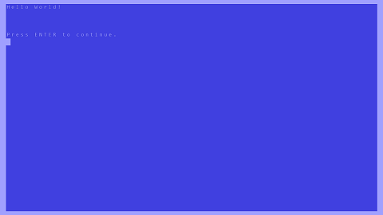
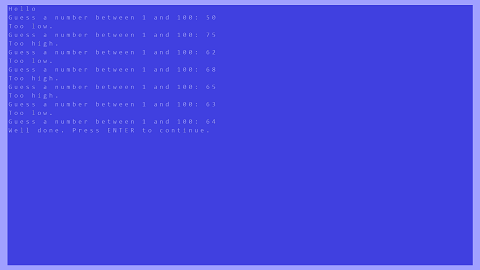

# RetroSharp

**RetroSharp** or **Retro#** is a C# library that makes learning to develop fun and easy by creating a development 
environment mimicking early development environments (retro), while maintaining the benefits of a modern language
like C#.

**RetroSharp** relies on [OpenTK](http://www.opentk.com/) for OpenGL rendering. It can be downloaded directly from
their site. A binary file (release from 2014-07-23) is also available in [Binaries folder](Binaries/OpenTK/Release) in this project. 
**RetroSharp** also relies on [OpenAL](https://www.openal.org/) for audio-output. An installation file for OpenAL
for Windows can also be found in the [Binaries folder](Binaries/OpenAL).

## How to begin

To create a retro-application using **RetroSharp**, you only need to reference the [RetroSharp](RetroSharp) library project and
derive your application from the [RetroApplication](RetroSharp/RetroApplication.cs) class. This class manages the retro environment,
including execution, character sets, sprites, rendering, console input/output, keyboard & mouse input, events, resources, audio,
hit-tests, drawing, file handling, etc., and it also manages the *OpenTK*, *OpenGL* and *OpenAL* libraries. Your application does 
not need to link to these libraries. The point of *RetroSharp* is to remove as much complexity of underlying libraries as 
possible, to make development quick, fun and easy and suitable for use for a first-time learner of programming.

## Templates

To make it easier to create a new project, there are two template projects available for you from the start:

| Template | Description |
|----------|-------------|
| [Character Template](Examples/CharacterTemplate) | The character template project sets up a retro console application for you. It's suitable for text-type applications. |
| [Raster Graphics Template](Examples/RasterGraphicsTemplate) | The raster graphics template project sets up a retro raster graphics application for you. It's suitable for applications where you need to need to draw on the screen. In raster graphics mode, you can still use console input/output if you choose to. |

To be able to use these templates from *Visual Studio*, you might have to export them first, once the solution has loaded.
Just select the template project in the *solution explorer* and select *Export Template...* from the *File* menu to export a
project as a *project template*. Once it has been exported as a *project template* it will be available as soon as you want to
create a new project, in the list of available templates.

## Examples

The solution includes a series of [examples](Examples) demonstrating how **RetroSharp** can be used. These [examples](Examples) 
are simple and aim to present a topic in a short and simple manner that is easy to read, understand, and reutilize. The 
[examples](Examples) are sorted into various categories, as shown below.

### Text and Strings

The examples sorted into the [Text and Strings](Examples/Text and Strings) category show how to input, process and output text in simple
console applications.

| Screen Shot | Project description |
|-------------|---------------------|
|| The [Hello World](Examples/Text and Strings/HelloWorld) project is probably the first project for many. It displays a "Hello World" message in a console application, just to show basic console output. |
|| The [Guess a number](Examples/Text and Strings/GuessANumber) project lets the user guess a random number between 1 and 100. The application terminates when the user guesses the number correctly. |

### Arithmetics

The examples available in the [Arithmetics](Examples/Arithmetics) category show how to perform simple numerical calculations.

### Screen Manipulation

The [Screen Manipulation](Examples/Screen Manipulation) category contains a list of projects showing how you can manipulate the screen directly
and modify character sets to create interesting applications.

### Raster Graphics

Applications introducing raster graphics are available in the [Raster Graphics](Examples/Raster Graphics) category. The applications show how
to perform different simple graphics operations.

### Sprites

Sprites are available in all screen modes, and provide a mechanism to display movable objects, possibly animated, on top of the screen. The
projects in the [Sprites](Examples/Sprites) category display different uses for sprites.

### Games

Finally, the [Games](Examples/Games) category contain more complete applications using the retro-environment to create a retro-game.