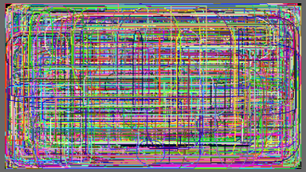

# RetroSharp

**RetroSharp** or **Retro#** is a C# library that makes learning to develop fun and easy by creating a development 
environment mimicking early development environments (retro), while maintaining the benefits of a modern language
like C#.

**RetroSharp** relies on [OpenTK](http://www.opentk.com/) for OpenGL rendering. You don't need to download this library
separately, as a binary file (release from 2014-07-23) is also available in [Binaries folder](Binaries/OpenTK/Release) in 
this project. If you want to get access to the source code for the [OpenTK](http://www.opentk.com/) library, you can
download it directly from their site.

If *OpenGL* is not available by default in your operating system, you might need to install it manually. The simplest way
to do this, is to download new drivers for your graphics card.

**RetroSharp** also relies on [OpenAL](https://www.openal.org/) for audio-output. An installation file for OpenAL
for Windows can also be found in the [Binaries folder](Binaries/OpenAL). You might need to install OpenAL on your
machine, if it has not been installed previously.

## How to begin

To create a retro-application using **RetroSharp**, you only need to reference the [RetroSharp](RetroSharp) library project and
derive your application from the [RetroApplication](RetroSharp/RetroApplication.cs) class. This class manages the retro environment,
including execution, character sets, sprites, rendering, console input/output, keyboard & mouse input, events, resources, audio,
hit-tests, drawing, file handling, etc., and it also manages the *OpenTK*, *OpenGL* and *OpenAL* libraries. Your application does 
not need to link to these libraries. The point of *RetroSharp* is to remove as much complexity of underlying libraries as 
possible, to make development quick, fun and easy and suitable for use for a first-time learner of programming.

## Templates

To make it easier to create a new project, there are two template projects available for you from the start:

| Template | Description |
|----------|-------------|
| [Character Template](Examples/CharacterTemplate) | The character template project sets up a retro console application for you. It's suitable for text-type applications. |
| [Raster Graphics Template](Examples/RasterGraphicsTemplate) | The raster graphics template project sets up a retro raster graphics application for you. It's suitable for applications where you need to need to draw on the screen. In raster graphics mode, you can still use console input/output if you choose to. |

To be able to use these templates from *Visual Studio*, you might have to export them first, once the solution has loaded.
Just select the template project in the *solution explorer* and select *Export Template...* from the *File* menu to export a
project as a *project template*. Once it has been exported as a *project template* it will be available as soon as you want to
create a new project, in the list of available templates.

## Examples

The solution includes a series of [examples](Examples) demonstrating how **RetroSharp** can be used. These [examples](Examples) 
are simple and aim to present a topic in a short and simple manner that is easy to read, understand, and reutilize. The 
[examples](Examples) are sorted into various categories, from very simple to more advanced, as shown below.

### Text and Strings

The examples sorted into the [Text and Strings](Examples/Text and Strings) category show how to input, process and output text in simple
console applications.

| Screen Shot | Project description |
|-------------|---------------------|
|| The [Hello World](Examples/Text and Strings/HelloWorld) project is probably the first project for many. It displays a "Hello World" message in a console application, just to show basic console output. [Full Screen Shot.](Images/HelloWorld.png) [Executable.](Executables/HelloWorld.zip) |
|| The [Guess a number](Examples/Text and Strings/GuessANumber) project lets the user guess a random number between 1 and 100. The application terminates when the user guesses the number correctly. [Full Screen Shot.](Images/GuessANumber.png) [Executable.](Executables/GuessANumber.zip) |

### Arithmetics

The examples available in the [Arithmetics](Examples/Arithmetics) category show how to perform simple numerical calculations.

| Screen Shot | Project description |
|-------------|---------------------|
|| The [Simple Arithmetics](Examples/Arithmetics/SimpleArithmetics) project shows how to perform simple computations with some basic console input/output. [Full Screen Shot.](Images/SimpleArithmetics.png) [Executable.](Executables/SimpleArithmetics.zip) |
|| The [Sinus1](Examples/Arithmetics/Sinus1) project outputs a simple sinus graf in console mode. [Full Screen Shot.](Images/Sinus1.png) [Executable.](Executables/Sinus1.zip) |
|| The [Sinus2](Examples/Arithmetics/Sinus2) project outputs a simple sinus graf in raster graphics mode. [Full Screen Shot.](Images/Sinus2.png) [Executable.](Executables/Sinus2.zip) |

### Text Screen Manipulation

The [Text Screen Manipulation](Examples/Text Screen Manipulation) category contains a list of projects showing how you can manipulate the text 
screen directly and modify character sets to create interesting applications.

| Screen Shot | Project description |
|-------------|---------------------|
|| The [Bouncing Character 1](Examples/Text Screen Manipulation/BouncingCharacter1) project shows how you can use direct screen manipulation to make a character bounce around the screen. [Full Screen Shot.](Images/BouncingCharacter1.png) [Executable.](Executables/BouncingCharacter1.zip) |
|| The [Bouncing Character 2](Examples/Text Screen Manipulation/BouncingCharacter2) project adds objects on the screen to the [Bouncing Character 1](Examples/Text Screen Manipulation/BouncingCharacter1) project with which the character can interact by bouncing against them. [Full Screen Shot.](Images/BouncingCharacter2.png) [Executable.](Executables/BouncingCharacter2.zip) |
|| The [Bouncing Character 3](Examples/Text Screen Manipulation/BouncingCharacter3) project adds simple user interaction though the keyboard to the [Bouncing Character 2](Examples/Text Screen Manipulation/BouncingCharacter2) project. [Full Screen Shot.](Images/BouncingCharacter3.png) [Executable.](Executables/BouncingCharacter3.zip) |
|| The [Bouncing Character 4](Examples/Text Screen Manipulation/BouncingCharacter4) project customizes the characters in [Bouncing Character 3](Examples/Text Screen Manipulation/BouncingCharacter3) project and shows how this technique can be used to create more interesting character-based user interfaces. [Full Screen Shot.](Images/BouncingCharacter4.png) [Executable.](Executables/BouncingCharacter4.zip) |
|| The [Bouncing Character 5](Examples/Text Screen Manipulation/BouncingCharacter5) project adds sound to the [Bouncing Character 4](Examples/Text Screen Manipulation/BouncingCharacter4) project, and plays a sound effect when the character bounces. [Full Screen Shot.](Images/BouncingCharacter5.png) [Executable.](Executables/BouncingCharacter5.zip) |
|| The [Create Labyrinth](Examples/Text Screen Manipulation/CreateLabyrinth) project creates a random labyrinth on the screen and lets a small entity randomly walk around in the labyrinth. [Full Screen Shot.](Images/CreateLabyrinth.png) [Executable.](Executables/CreateLabyrinth.zip) |

### Raster Graphics

Applications introducing raster graphics are available in the [Raster Graphics](Examples/Raster Graphics) category. The applications show how
to perform different simple graphics operations.

| Screen Shot | Project description |
|-------------|---------------------|
|| The [Clip Lines](Examples/Raster Graphics/ClipLines) project modifies the [Moiré Lines](Examples/Raster Graphics/MoireLines) project, experimenting with line clipping to draw inside subsections of the screen. [Full Screen Shot.](Images/ClipLines.png) [Executable.](Executables/ClipLines.zip) |
|| The [Gradients](Examples/Raster Graphics/Gradients) project shows how different procedural fill methods can be used. [Full Screen Shot.](Images/Gradients.png) [Executable.](Executables/Gradients.zip) |
|| The [Moiré Lines](Examples/Raster Graphics/MoireLines) project shows an interesting visual effect when drawing lines on a raster display with limited resolution. [Full Screen Shot.](Images/MoireLines.png) [Executable.](Executables/MoireLines.zip) |
|| The [Random Boxes](Examples/Raster Graphics/RandomBoxes) project randomly draws boxes on the raster display as quickly as possible. [Full Screen Shot.](Images/RandomBoxes.png) [Executable.](Executables/RandomBoxes.zip) |
|| The [Random Ellipses](Examples/Raster Graphics/RandomEllipses) project randomly draws ellipses on the raster display as quickly as possible. [Full Screen Shot.](Images/RandomEllipses.png) [Executable.](Executables/RandomEllipses.zip) |
|| The [Random FilledEllipses](Examples/Raster Graphics/RandomFilledEllipses) project randomly draws filled ellipses on the raster display as quickly as possible. [Full Screen Shot.](Images/RandomFilledEllipses.png) [Executable.](Executables/RandomFilledEllipses.zip) |
|| The [Random Lines](Examples/Raster Graphics/RandomLines) project randomly draws lines on the raster display as quickly as possible. [Full Screen Shot.](Images/RandomLines.png) [Executable.](Executables/RandomLines.zip) |
|| The [Random Plots](Examples/Raster Graphics/RandomPlots) project randomly draws pixels on the raster display as quickly as possible. [Full Screen Shot.](Images/RandomPlots.png) [Executable.](Executables/RandomPlots.zip) |
|| The [Random Rectangles](Examples/Raster Graphics/RandomRectangles) project randomly draws rectangles on the raster display as quickly as possible. [Full Screen Shot.](Images/RandomRectangles.png) [Executable.](Executables/RandomRectangles.zip) |
|| The [Random Rounded Boxes](Examples/Raster Graphics/RandomRoundedBoxes) project randomly draws rounded boxes on the raster display as quickly as possible. [Full Screen Shot.](Images/RandomRoundedBoxes.png) [Executable.](Executables/RandomRoundedBoxes.zip) |
|| The [Random Rounded Rectangles](Examples/Raster Graphics/RandomRoundedRectangles) project randomly draws rectangles on the raster display as quickly as possible. [Full Screen Shot.](Images/RandomRoundedRectangles.png) [Executable.](Executables/RandomRoundedRectangles.zip) |

### Sprites

Sprites are available in all screen modes, and provide a mechanism to display movable objects, possibly animated, on top of the screen. The
projects in the [Sprites](Examples/Sprites) category display different uses for sprites.

| Screen Shot | Project description |
|-------------|---------------------|
|| The [Bouncing Balls](Examples/Sprites/BouncingBalls) project animates a set of bouncing balls over a console screen, with some sound effects. [Full Screen Shot.](Images/BouncingBalls.png) [Executable.](Executables/BouncingBalls.zip) |
|| The [Mouse Pointer](Examples/Sprites/MousePointer) allows the user to interact with the application using the mouse and draw on the raster screen. The project also shows how sprites can be rotated. [Full Screen Shot.](Images/MousePointer.png) [Executable.](Executables/MousePointer.zip) |

### Games

Finally, the [Games](Examples/Games) category contain more complete applications using the retro-environment to create a retro-game.

| Screen Shot | Project description |
|-------------|---------------------|
|| The [Asteroids](Examples/Games/Asteroids) project implements a version of the classic *Asteroids* game. [Full Screen Shot.](Images/Asteroids.png) [Executable.](Executables/Asteroids.zip) |
|| The [Text Adventure](Examples/Games/TextAdventure) project implements the skeleton of a simple text adventure game. [Full Screen Shot.](Images/TextAdventure.png) [Executable.](Executables/TextAdventure.zip) |
|| The [Text Adventure 2](Examples/Games/TextAdventure2) project generlizes the [Text Adventure](Examples/Games/TextAdventure) project by creating a text adventure engine that reads an XML file containing the information required to setup the game. [Full Screen Shot.](Images/TextAdventure2.png) [Executable.](Executables/TextAdventure2.zip) |
